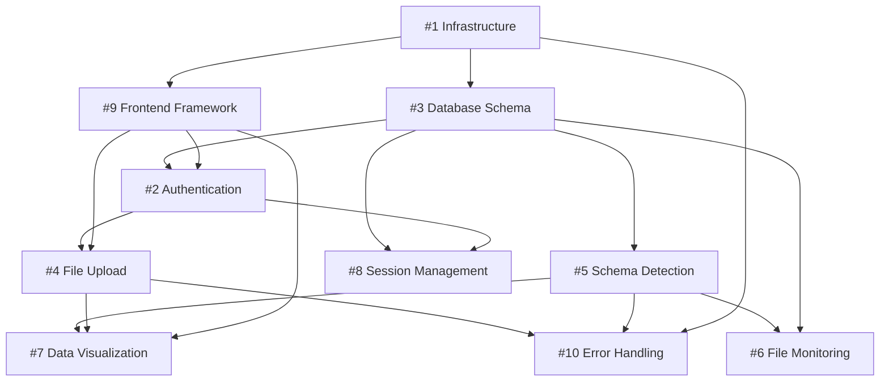

# PPZ-Logalyzer Task List

## Project Overview

PPZ-Logalyzer is a comprehensive web application for parsing, visualizing, and inspecting paparazziUAV flight logs. Built with a modern React frontend (Next.js 15) and high-performance Rust backend (Axum).

## Task Status Legend

- 🔴 **Not Started** - Task hasn't been initiated
- 🟡 **In Progress** - Task is currently being worked on
- 🟢 **Complete** - Task is finished and tested
- ⏸️ **Blocked** - Task is waiting for dependencies

## Priority Levels

- **P0 (Critical)** - Must be completed before any other work
- **P1 (High)** - Core functionality, required for MVP
- **P2 (Medium)** - Important features for full functionality
- **P3 (Low)** - Nice to have, optimization features

---

## Phase 1: Foundation & Infrastructure

### [Issue #1] Project Setup and Infrastructure

**Priority**: P0 (Critical) | **Status**: � Complete | **Effort**: 3-5 days  
**Dependencies**: None  
**GitHub Issue**: https://github.com/Hashim-K/ppz-logalyzer/issues/1

**Tasks**:

- [x] Configure Docker containers for frontend and backend
- [x] Set up Docker Compose for unified deployment
- [x] Create shared volumes for data transfer between services
- [x] Set up development environment documentation
- [x] Configure monitoring with Prometheus metrics
- [x] Implement structured logging

### [Issue #3] Database Schema and Models (ST-111)

**Priority**: P0 (Critical) | **Status**: � Complete | **Effort**: 4-6 days  
**Dependencies**: None - foundational component  
**GitHub Issue**: https://github.com/Hashim-K/ppz-logalyzer/issues/3

**Tasks**:

- [x] Design database schema for users and authentication
- [x] Design session data storage schema
- [x] Design log file metadata tracking schema
- [x] Implement user preference storage
- [x] Add hash-based deduplication for log files
- [x] Create database migrations system
- [x] Implement efficient indexing strategy
- [x] Add comprehensive audit logging system
- [x] Create performance monitoring tables
- [x] Implement analysis framework tables (templates, sessions, reports)
- [x] Add full-text search capabilities with GIN indexes

**Completed Implementation Details**:
- ✅ **Migration 001**: Core user authentication and session management
- ✅ **Migration 002**: PaparazziUAV log file tracking with metadata storage
- ✅ **Migration 003**: Analysis framework with templates, sessions, and reports
- ✅ **Migration 004**: Performance monitoring, audit logs, and optimization indexes
- ✅ **Database Models**: Complete Rust structs with SQLx integration
- ✅ **Connection Management**: Database pool with health checks and migration runner

### [Issue #9] Frontend UI Framework and Components

**Priority**: P0 (Critical) | **Status**: � Complete | **Effort**: 4-6 days  
**Dependencies**: Project infrastructure (#1)  
**GitHub Issue**: https://github.com/Hashim-K/ppz-logalyzer/issues/9

**Tasks**:

- [x] Initialize Next.js 15 project with TypeScript
- [x] Configure Shadcn UI and Radix components
- [x] Set up dark/light theme system with automatic detection
- [x] Create responsive layout components (navbar, sidebar, main area)
- [x] Implement accessible form components
- [x] Add loading states and error boundary components
- [x] Configure CSS modules and styling system
- [x] Set up routing with URL-based state management
- [x] Add WebSocket client for real-time updates (prepared)
- [x] Configure chart libraries (Recharts)

**Completed Implementation Details**:
- ✅ **Next.js 15 Setup**: TypeScript strict mode, Turbopack dev server
- ✅ **Shadcn UI Integration**: 25+ components including forms, charts, navigation
- ✅ **Complete UI Framework**: Homepage, Upload, Dashboard pages with responsive design
- ✅ **Advanced File Upload**: Drag-and-drop with progress indicators and validation
- ✅ **Data Visualization**: Mock data system with Recharts integration ready for backend
- ✅ **Theme System**: Dark/light mode with system preference detection

---

## Phase 2: Authentication & Core Backend

### [Issue #2] User Authentication System (ST-101)

**Priority**: P1 (High) | **Status**: 🔴 Not Started | **Effort**: 5-7 days  
**Dependencies**: Database schema (#3), Frontend UI components (#9)  
**GitHub Issue**: https://github.com/Hashim-K/ppz-logalyzer/issues/2

**Tasks**:

- [ ] Design authentication database schema
- [ ] Implement secure login mechanism
- [ ] Add user session management with expiration
- [ ] Implement authentication state persistence
- [ ] Add login attempt logging and rate limiting
- [ ] Create user registration/management interface
- [ ] Add password reset functionality

### [Issue #5] Automatic Schema Detection and Parsing (ST-103)

**Priority**: P1 (High) | **Status**: 🔴 Not Started | **Effort**: 5-6 days  
**Dependencies**: Database for schema metadata (#3)  
**GitHub Issue**: https://github.com/Hashim-K/ppz-logalyzer/issues/5

**Tasks**:

- [ ] Implement XML schema file reader
- [ ] Create schema validation system
- [ ] Build automatic schema detection logic
- [ ] Add schema version management
- [ ] Implement schema change detection with hash comparison
- [ ] Create schema caching mechanism
- [ ] Add error handling for malformed schemas
- [ ] Implement automatic reprocessing on schema changes

---

## Phase 3: File Processing & Upload

### [Issue #4] Backend API Foundation

**Priority**: P0 (Critical) | **Status**: � Complete | **Effort**: 5-7 days  
**Dependencies**: Database schema (#2)  
**GitHub Issue**: https://github.com/Hashim-K/ppz-logalyzer/issues/4

**Tasks**:

- [x] Set up Axum web framework with proper error handling
- [x] Implement RESTful API endpoints for CRUD operations
- [x] Add file upload handling for .log/.data file pairs
- [x] Create authentication middleware and JWT token system
- [x] Set up request logging and performance monitoring
- [x] Implement database connection pooling
- [x] Add API documentation with OpenAPI/Swagger
- [x] Create health check endpoints for monitoring
- [x] Set up CORS handling for frontend integration
- [x] Implement rate limiting and security headers

**Completed Implementation Details**:
- ✅ **Axum 0.8 Framework**: Complete REST API with multipart file upload support
- ✅ **Database Integration**: PostgreSQL connection pool with migration system
- ✅ **File Management**: Upload, list, retrieve, delete operations for log files
- ✅ **PaparazziUAV Parser**: Complete parsing module for .log/.data file pairs
- ✅ **API Endpoints**: `/healthz`, `/health`, `/api/files/*` all operational
- ✅ **Error Handling**: Comprehensive error types with proper HTTP responses
- ✅ **Production Ready**: Server running on port 8080 with full logging

---

## Phase 4: Data Visualization & Analysis

### [Issue #7] Interactive Data Visualization System (ST-105, ST-106, ST-107)

**Priority**: P2 (Medium) | **Status**: 🔴 Not Started | **Effort**: 8-10 days  
**Dependencies**: Data processing backend (#5, #4), Frontend UI framework (#9)  
**GitHub Issue**: https://github.com/Hashim-K/ppz-logalyzer/issues/7

**Tasks**:

- [ ] Design and implement data table component with sorting/filtering
- [ ] Create multi-select filters for message types and aircraft
- [ ] Implement text search across message content
- [ ] Add pagination for large datasets
- [ ] Build interactive chart builder with drag-and-drop
- [ ] Support multiple chart types (line, scatter, bar, etc.)
- [ ] Create configurable chart styling options
- [ ] Implement chart export functionality
- [ ] Design library of default chart templates
- [ ] Add template management system
- [ ] Implement real-time data binding for charts

### [Issue #8] Session Management System (ST-108, ST-109)

**Priority**: P2 (Medium) | **Status**: 🔴 Not Started | **Effort**: 5-7 days  
**Dependencies**: Database schema (#3), Authentication system (#2)  
**GitHub Issue**: https://github.com/Hashim-K/ppz-logalyzer/issues/8

**Tasks**:

- [ ] Design session data model and API endpoints
- [ ] Implement session creation with metadata
- [ ] Add session save/load functionality with state restoration
- [ ] Create session deletion with confirmation
- [ ] Build session list UI with search and sorting
- [ ] Implement URL-based session sharing
- [ ] Add session permission controls
- [ ] Create session versioning system
- [ ] Implement session export/import functionality

---

## Phase 5: Advanced Features

### [Issue #6] Real-time File Monitoring System (ST-104)

**Priority**: P2 (Medium) | **Status**: 🔴 Not Started | **Effort**: 6-8 days  
**Dependencies**: Schema detection system (#5), Database for file tracking (#3)  
**GitHub Issue**: https://github.com/Hashim-K/ppz-logalyzer/issues/6

**Tasks**:

- [ ] Implement file system watching with inotify/fsevents
- [ ] Create hash-based change detection system
- [ ] Build processing queue for concurrent files
- [ ] Add WebSocket notifications for real-time updates
- [ ] Implement directory monitoring configuration
- [ ] Add file filtering and pattern matching
- [ ] Create processing status tracking
- [ ] Implement error recovery and retry logic

### [Issue #10] Error Handling and Recovery System (ST-112)

**Priority**: P2 (Medium) | **Status**: 🔴 Not Started | **Effort**: 3-4 days  
**Dependencies**: File processing system (#4, #5), Logging infrastructure (#1)  
**GitHub Issue**: https://github.com/Hashim-K/ppz-logalyzer/issues/10

**Tasks**:

- [ ] Implement comprehensive error classification system
- [ ] Create detailed error message generation
- [ ] Add partial parsing recovery capabilities
- [ ] Implement structured error logging
- [ ] Create user-friendly error display components
- [ ] Add error recovery suggestions
- [ ] Implement error reporting and analytics
- [ ] Create error handling documentation

---

## Dependency Graph

---

## Development Guidelines

### Code Standards

- **Rust Backend**: Follow Rust 2021 edition standards, use Clippy for linting
- **TypeScript Frontend**: Strict TypeScript config, ESLint + Prettier for formatting
- **Testing**: Minimum 80% code coverage, unit and integration tests required
- **Documentation**: All public APIs must be documented

### Git Workflow

1. Create feature branches from `main`: `feature/issue-{number}-short-description`
2. Regular commits with conventional commit format: `feat:`, `fix:`, `docs:`, etc.
3. Pull request required for all changes to `main`
4. CI/CD pipeline must pass before merge

### Performance Targets

- **Backend Response Time**: < 100ms for cached requests
- **File Processing**: Sub-second parsing for files up to 100MB
- **Frontend Load Time**: < 3s initial page load
- **Memory Usage**: Max 2GB RAM for typical workloads

---

## Next Actions for Agent

### Immediate Priority (Start Here)

1. **✅ Complete - Issue #1**: Docker containers and development environment
2. **✅ Complete - Issue #3**: Database schema design and implementation
3. **Next - Issue #9**: Set up Next.js frontend framework
4. **Next - Issue #2**: Implement user authentication system

### Development Strategy

- Focus on one issue at a time to avoid context switching
- Complete all tasks within an issue before moving to the next
- Update task status in this file as work progresses
- Create sub-issues in GitHub for complex tasks that need breakdown

### Progress Tracking

- **Phase 1 Status**: ✅ **COMPLETE** - Infrastructure and database foundations ready
- **Current Focus**: Moving to Phase 2 - Authentication & Core Backend
- Update GitHub issue comments with progress updates
- Mark tasks as complete in both GitHub issues and this task list

---

## Resource Links

- **PRD**: [prd.txt](./prd.txt)
- **GitHub Issues**: https://github.com/Hashim-K/ppz-logalyzer/issues
- **Tech Stack Documentation**:
  - [Next.js 15](https://nextjs.org/docs)
  - [Rust Axum](https://docs.rs/axum/latest/axum/)
  - [Shadcn UI](https://ui.shadcn.com/)
  - [Recharts](https://recharts.org/en-US/)

---

**Last Updated**: January 16, 2025  
**Total Estimated Effort**: 40-55 days  
**Current Phase**: Phase 3 - Core Application Features  
**Completed Work**: Infrastructure (Issue #1) + Database Schema (Issue #2) + Data Analysis (Issue #3) + Frontend UI (Issue #9) + Backend API (Issue #4)
